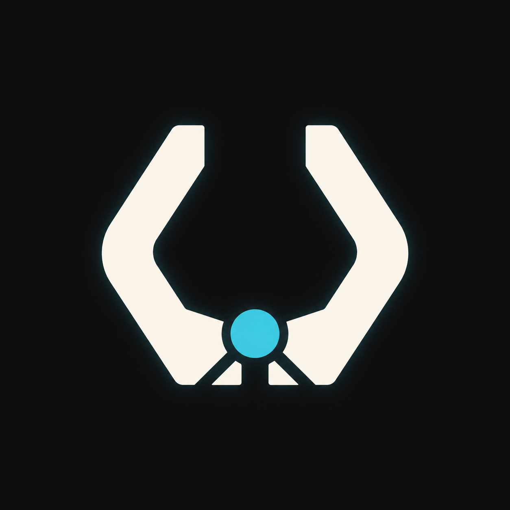

<p align="center">
  
</p>

<h1 align="center">UltraCode</h1>

<p align="center">
  Transparent, adaptive multi-agent software engineering for Codex.
</p>

<p align="center">
  <a href="https://github.com/emanueledenaro/ultracode/actions/workflows/validate.yml"></a>
  <a href="LICENSE"></a>
  
  
</p>

UltraCode is a Codex plugin that keeps complex AI engineering work observable, interruptible, and evidence-driven. It inspects the real project, derives bounded jobs from the problem, schedules them through available capacity, verifies material findings adversarially, and produces one coherent result.

It does not choose an impressive-looking agent count. It derives the work graph from the code and shows the user what is complete, active, queued, blocked, changed, and validated.

## Install

Add this repository as a Codex marketplace, then install the plugin:

```powershell
codex plugin marketplace add emanueledenaro/ultracode
codex plugin add ultracode@ultracode
```

Start a new Codex task after installation so the skills are reloaded.

UltraCode has no account, API key, MCP server, background service, or telemetry requirement.

## Use

Invoke the skill that matches the job:

| Skill | Purpose |
| --- | --- |
| `$ultracode-help` | Explain the commands, recommend the right one, and provide safe copyable examples. It is always read-only. |
| `$ultracode` | Execute engineering work end to end. Before writing, it explains the objective, the jobs it derived, who owns them, and how completion will be verified. |
| `$ultracode-init` | Inspect a repository and explain, in plain language, what project guidance it proposes, why each file is useful, and what will change. It writes only after confirmation. |
| `$ultracode-edit` | Explain the requested configuration change as a before-and-after delta, detect conflicts or manual edits, and update only the affected managed content after confirmation. |
| `$ultracode-flow` | Give a quick, read-only control view: objective, current phase, active or blocked tickets, responsible agent, requested and effective model and effort, completion criterion, and immediate next action. |
| `$ultracode-status` | Give the detailed, read-only diagnostic view: full job state, files, checks, evidence, blockers, configuration drift, and next action. |

Examples:

```text
Use $ultracode-help to explain which command I need for a configuration change.
Use $ultracode-init to configure this repository for Codex and Claude Code.
Use $ultracode to migrate this subsystem and prove behavioral parity.
Use $ultracode-flow to show quickly what is happening right now.
Use $ultracode-status to diagnose why a job is blocked and inspect its evidence.
Use $ultracode-edit to change the validation commands and status policy.
```

Choose `$ultracode-help` when you need to understand or select a command. Use `$ultracode` for an engineering outcome, `$ultracode-init` to propose baseline project control, `$ultracode-edit` to change existing control, `$ultracode-flow` for a quick live snapshot, and `$ultracode-status` for the detailed evidence view. Help, Flow, and Status are always read-only; none starts work, initializes a repository, or runs checks merely to answer.

Invoking `$ultracode-help` without a topic returns the complete command overview. Add a topic such
as `flow` or `models` for focused help, or explicitly add `breve` or `sintetico` when you want the
compact version. The wording can vary between tasks, but the required facts do not.

The complete overview is formatted for the chat surface: a quick-choice table, one H3 section per
command, four short labeled fields, an example beside each command, and compact comparison tables
for model routing and tickets versus agents. Examples are not repeated in a separate footer.

`$ultracode-flow` and `$ultracode-status` are both read-only, but answer different questions. Flow answers “what is happening right now?” with a short control view. Status answers “what exactly happened, what proves it, and why is anything blocked?” with the full diagnostic detail. Neither command invents progress percentages, completion times, agents, models, or results that the runtime does not expose.

All six commands use the same plain-language interface. A ticket is one bounded unit of work, not an extra tracking system: it reuses the real UltraCode job ID. For every active or blocked ticket, UltraCode explains what it is doing, why it exists, who is responsible, whether a live agent is attached, which model and reasoning effort were requested, which values are actually running when observable, why they were selected, and the concrete condition that marks the ticket complete. Internal labels and evidence states are translated into the user's language instead of being shown without explanation.

When `$ultracode` receives change work in a project that has not been initialized, it preserves the
original task and automatically runs the read-only discovery and planning part of
`$ultracode-init`. It explains the proposed project control and asks before writing it. After a
confirmed, doctor-valid initialization, it resumes the original task automatically. Simple
answers, reviews, and diagnoses remain read-only and do not initialize the repository merely to
inspect it.

## Models, effort, and swarm sizing

For a new UltraCode task, choose Sol with medium effort as the recommended lead baseline when the
Codex interface exposes those controls. This gives coordination and synthesis enough depth without
using critical-review effort on every turn. UltraCode does not change an already-open task or the
user's global Codex configuration automatically.

Once opened, UltraCode inherits the task's model and effort. Normal subagents default to Terra with low effort, increasing only when the objective requires it. Verifiers use Sol with at least high effort; critical work uses at least xhigh. Requested model and effort are routing intent; effective values and a fallback are reported only when the runtime exposes them. If the runtime does not expose them, UltraCode says so instead of presenting preferences as observed facts.

## How the swarm is sized

```text
logical jobs = independent data units
             + orthogonal blind-spot lenses
             + one verifier per material finding
             + one synthesis
```

If a task exposes 37 independent units, UltraCode may derive 37 unit jobs. That does not mean 37 agents run simultaneously: the available platform capacity schedules the jobs in visible waves. A configured safety cap is a circuit breaker, never a target or a silent truncation rule.

Simple work stays direct. UltraCode does not manufacture a swarm when parallelism would add no value.

## Control model


The live conversation remains the primary control surface. UltraCode reports real milestones and counts, not invented percentages or hidden work. Pause, stop, and redirect instructions are treated as immediate control events.

## Project initialization

`$ultracode-init` can create a generic project-control structure based on the repository it actually inspects:

```text
.ultracode/        canonical configuration and managed-file hashes
.agents/           shared context, rules, reviewers, and project skills
.codex/            Codex projections when needed
.claude/           Claude Code projections and imports
AGENTS.md          shared root contract through a managed block
```

Generated adapters point back to canonical guidance instead of duplicating project truth. Existing manual files and content outside managed blocks are preserved. Machine-local settings, credentials, permission allowlists, caches, locks, and absolute paths are excluded.

Initialization and editing use a deterministic two-step configurator: `plan` is read-only and returns exact changes plus a stable plan ID; `apply` accepts only that confirmed plan, rejects drift and unsafe paths, replaces each file atomically, restores earlier writes if a later write fails, and becomes a byte-and-mtime no-op when repeated. Exact runtime-exposed model IDs can be stored when supplied by the user; unavailable IDs use the configured fallback and must be reported.

## Safety and evidence

- Read-only requests stay read-only.
- Existing worktree changes remain user-owned.
- External actions, publishing, deployment, destructive operations, and credential use require explicit authority.
- Material findings are independently challenged when collaboration is available.
- Validation claims require real exit codes, logs, artifacts, or user-visible behavior.
- Missing evidence is reported as unknown; inference is never presented as verification.
- Automatic fix-and-review loops are bounded.

## Repository layout

```text
.agents/plugins/marketplace.json     public Codex marketplace
.github/workflows/validate.yml       repository and contract validation
plugins/ultracode/                   installable plugin payload
  .codex-plugin/plugin.json          plugin manifest
  assets/ultracode-icon.png          brand asset
  skills/
    ultracode/                        orchestration protocol, configurator, validators, and command guide
    ultracode-help/                   read-only command guide and chooser
    ultracode-init/                   guided project initializer
    ultracode-edit/                   drift-safe editor
    ultracode-flow/                   quick read-only control view
    ultracode-status/                 detailed read-only diagnostic view
scripts/validate_repository.py       dependency-free repository validator
```

## Validate locally

From the repository root:

```powershell
python scripts/validate_repository.py
python plugins/ultracode/skills/ultracode/scripts/run_project_configurator_corpus.py
python plugins/ultracode/skills/ultracode/scripts/check_contract.py
powershell.exe -NoProfile -ExecutionPolicy Bypass -File plugins/ultracode/skills/ultracode/scripts/check_contract.ps1
```

Both contract implementations must agree. The checks include the plugin payload attestation, behavioral evidence structure, deterministic configurator corpus, generated-project doctor corpus, casing attacks, malformed schemas, drift detection, reparse-point boundaries, and adapter semantic checks.

## Contributing and security

See [CONTRIBUTING.md](CONTRIBUTING.md) before opening a pull request. Report security issues privately through [GitHub Security Advisories](https://github.com/emanueledenaro/ultracode/security/advisories/new), following [SECURITY.md](SECURITY.md).

## License

UltraCode is released under the [MIT License](LICENSE).
