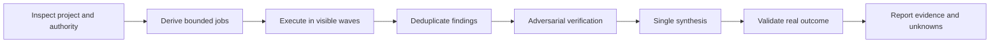

<p align="center">
  
</p>

<h1 align="center">UltraCode</h1>

<p align="center">
  Transparent, adaptive multi-agent software engineering for Codex.
</p>

<p align="center">
  <a href="https://github.com/emanueledenaro/ultracode/actions/workflows/validate.yml"></a>
  <a href="LICENSE"></a>
  
  
</p>

UltraCode is a Codex plugin that keeps complex AI engineering work observable, interruptible, and evidence-driven. It inspects the real project, derives bounded jobs from the problem, schedules them through available capacity, verifies material findings adversarially, and produces one coherent result.

It does not choose an impressive-looking agent count. It derives the work graph from the code and shows the user what is complete, active, queued, blocked, changed, and validated.

## Install

Add this repository as a Codex marketplace, then install the plugin:

```powershell
codex plugin marketplace add emanueledenaro/ultracode
codex plugin add ultracode@ultracode
```

Start a new Codex task after installation so the skills are reloaded.

UltraCode has no account, API key, MCP server, background service, or telemetry requirement.

## Use

Invoke the skill that matches the job:

| Skill | Purpose |
| --- | --- |
| `$ultracode` | Execute complex engineering work end to end with visible control and proportionate verification. |
| `$ultracode-init` | Inspect a repository, ask only the missing questions, preview the setup, and generate shared Codex and Claude Code project guidance. |
| `$ultracode-edit` | Change the managed configuration or adapters without overwriting manual work. |
| `$ultracode-status` | Explain current progress, agents, files, checks, blockers, and next action without mutating the project. |

Examples:

```text
Use $ultracode-init to configure this repository for Codex and Claude Code.
Use $ultracode to migrate this subsystem and prove behavioral parity.
Use $ultracode-status to show where the work is and what remains.
Use $ultracode-edit to change the validation commands and status policy.
```

## How the swarm is sized

```text
logical jobs = independent data units
             + orthogonal blind-spot lenses
             + one verifier per material finding
             + one synthesis
```

If a task exposes 37 independent units, UltraCode may derive 37 unit jobs. That does not mean 37 agents run simultaneously: the available platform capacity schedules the jobs in visible waves. A configured safety cap is a circuit breaker, never a target or a silent truncation rule.

Simple work stays direct. UltraCode does not manufacture a swarm when parallelism would add no value.

## Control model



The live conversation remains the primary control surface. UltraCode reports real milestones and counts, not invented percentages or hidden work. Pause, stop, and redirect instructions are treated as immediate control events.

## Project initialization

`$ultracode-init` can create a generic project-control structure based on the repository it actually inspects:

```text
.ultracode/        canonical configuration and managed-file hashes
.agents/           shared context, rules, reviewers, and project skills
.codex/            Codex projections when needed
.claude/           Claude Code projections and imports
AGENTS.md          shared root contract through a managed block
```

Generated adapters point back to canonical guidance instead of duplicating project truth. Existing manual files and content outside managed blocks are preserved. Machine-local settings, credentials, permission allowlists, caches, locks, and absolute paths are excluded.

## Safety and evidence

- Read-only requests stay read-only.
- Existing worktree changes remain user-owned.
- External actions, publishing, deployment, destructive operations, and credential use require explicit authority.
- Material findings are independently challenged when collaboration is available.
- Validation claims require real exit codes, logs, artifacts, or user-visible behavior.
- Missing evidence is reported as unknown; inference is never presented as verification.
- Automatic fix-and-review loops are bounded.

## Repository layout

```text
.agents/plugins/marketplace.json     public Codex marketplace
.github/workflows/validate.yml       repository and contract validation
plugins/ultracode/                   installable plugin payload
  .codex-plugin/plugin.json          plugin manifest
  assets/ultracode-icon.png          brand asset
  skills/ultracode/                  orchestration protocol and validators
  skills/ultracode-init/             guided project initializer
  skills/ultracode-edit/             drift-safe editor
  skills/ultracode-status/           read-only control view
scripts/validate_repository.py       dependency-free repository validator
```

## Validate locally

From the repository root:

```powershell
python scripts/validate_repository.py
python plugins/ultracode/skills/ultracode/scripts/check_contract.py
powershell.exe -NoProfile -ExecutionPolicy Bypass -File plugins/ultracode/skills/ultracode/scripts/check_contract.ps1
```

Both contract implementations must agree. The checks include the plugin payload attestation, behavioral evidence structure, generated-project doctor corpus, casing attacks, malformed schemas, drift detection, reparse-point boundaries, and adapter semantic checks.

## Contributing and security

See [CONTRIBUTING.md](CONTRIBUTING.md) before opening a pull request. Report security issues privately through [GitHub Security Advisories](https://github.com/emanueledenaro/ultracode/security/advisories/new), following [SECURITY.md](SECURITY.md).

## License

UltraCode is released under the [MIT License](LICENSE).
